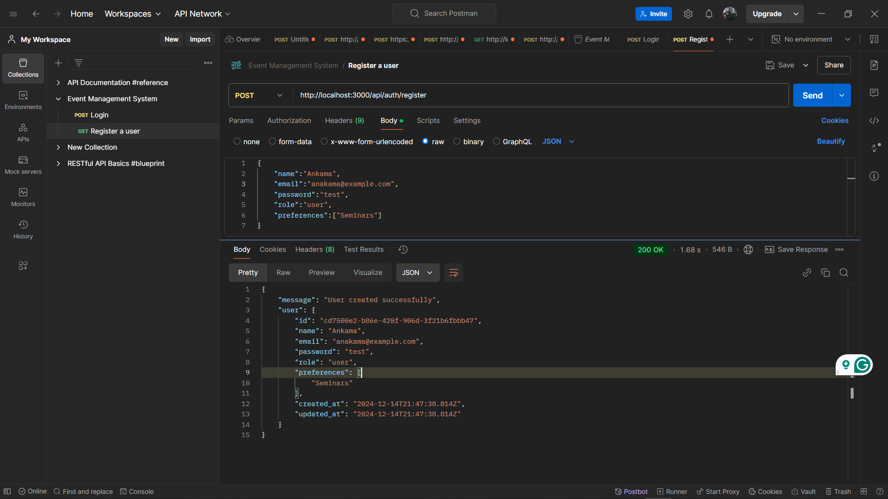
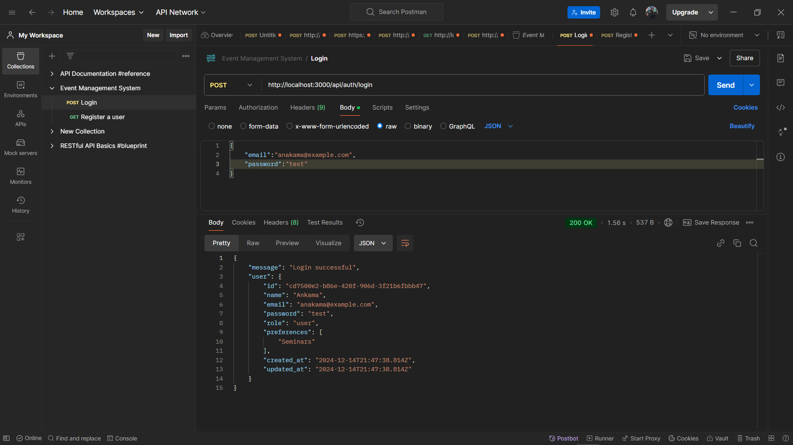
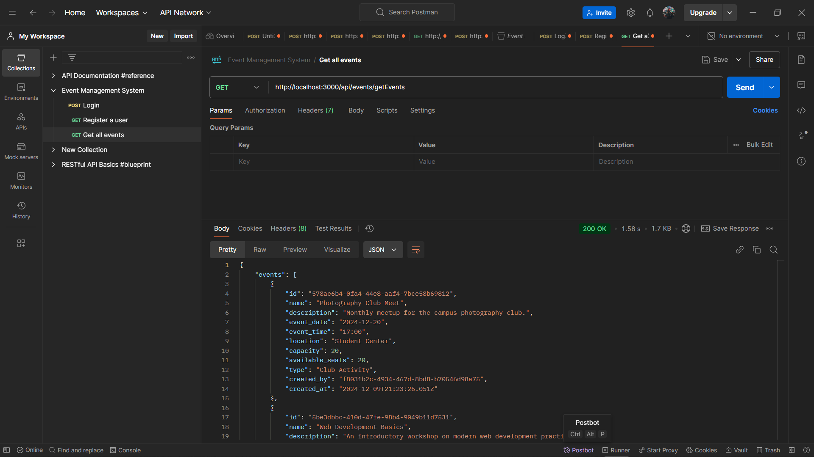
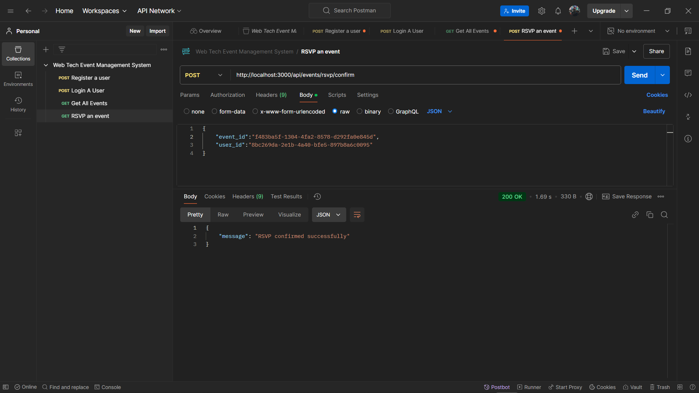
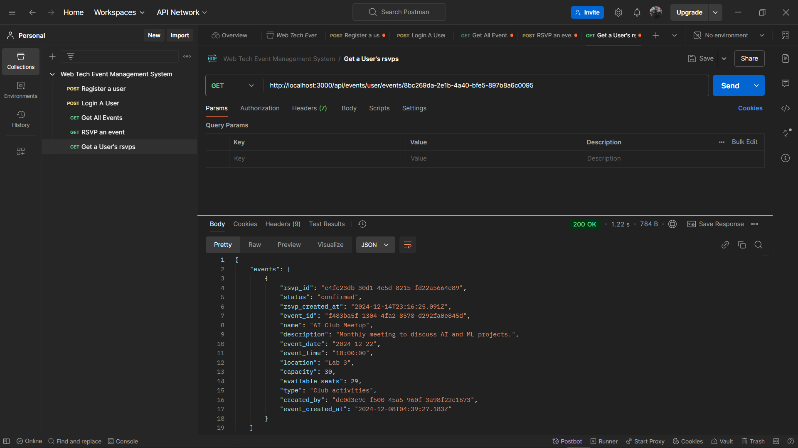
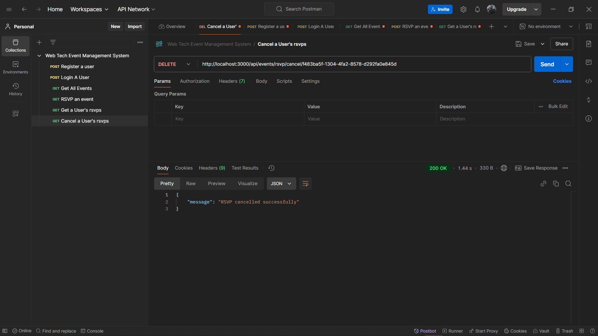

# Node.js + PostgreSQL Backend

This project is a backend application built with Node.js and PostgreSQL, designed to manage campus events. It provides a RESTful API for user authentication, event management, and RSVP functionalities.

## Table of Contents

- [Features](#features)
- [Technologies Used](#technologies-used)
- [Getting Started](#getting-started)
- [Environment Variables](#environment-variables)
- [API Endpoints](#api-endpoints)
- [Middleware](#middleware)
- [Database Configuration](#database-configuration)
- [Contributing](#contributing)
- [License](#license)
- [API Testing with Postman](#api-testing-with-postman)

## Features

- **User Authentication**: Register and login users with JWT-based authentication.
- **Event Management**: Create, view, and manage events.
- **RSVP System**: Users can RSVP to events, and the system manages available seats.
- **Role-based Access Control**: Different access levels for users and admins.

## Technologies Used

- **Node.js**: JavaScript runtime for building the server-side application.
- **Express.js**: Web framework for Node.js to build the API.
- **PostgreSQL**: Relational database for storing user and event data.
- **JWT**: JSON Web Tokens for secure authentication.
- **bcryptjs**: Library for hashing passwords.

## Getting Started

### Prerequisites

- Node.js and npm installed on your machine.
- PostgreSQL database setup.

### Installation

1. Clone the repository:

   ```bash
   git clone https://github.com/yourusername/your-repo.git
   cd your-repo/Nodejs-postgress
   ```

2. Install dependencies:

   ```bash
   npm install
   ```

3. Set up environment variables (see [Environment Variables](#environment-variables)).

4. Start the server:
   ```bash
   npm start
   ```

## Environment Variables

Create a `.env` file in the root directory and add the following variables:

```plaintext
SUPABASE_URL=your_database_url
JWT_SECRET=your_jwt_secret
JWT_EXPIRES=token_expiry_time
PORT=your_port_number
```

## API Endpoints

### Authentication

- **Register User**: `POST /api/auth/register`
- **Login User**: `POST /api/auth/login`
- **Verify Token**: `GET /api/auth/verify`

### Events

- **Create Event**: `POST /api/events/create` (Admin only)
- **Get All Events**: `GET /api/events/allevents`
- **Confirm RSVP**: `POST /api/events/rsvp/confirm` (User only)
- **Get User Events**: `GET /api/events/user/events/:userId` (User only)
- **Cancel RSVP**: `DELETE /api/events/rsvp/cancel/:eventId` (User only)

## Middleware

- **Authentication Middleware**: Ensures that routes are protected and accessible only to authenticated users.
  - `authenticate`: For admin routes.
  - `userAuthenticate`: For user routes.

## Database Configuration

The database is configured using the `pg` library. Connection details are managed through environment variables.

```javascript:Nodejs-postgress/api/config/db.js
startLine: 1
endLine: 15
```

## Contributing

Contributions are welcome! Please fork the repository and submit a pull request for any improvements or bug fixes.

## License

This project is licensed under the MIT License. See the [LICENSE](LICENSE) file for details.

## API Testing with Postman

To ensure the API endpoints are working correctly, you can use Postman for testing. Below are some screenshots demonstrating how to test the API endpoints:

### Register User


### Login User


### Create Event


### Get All Events


### Confirm RSVP


### Get User Events


### Cancel RSVP


